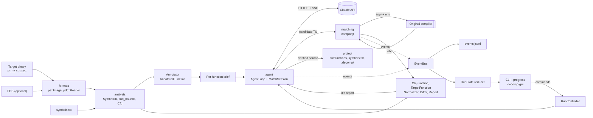

# Architecture

Decomp is one C++23 code base that premake5 builds into a static library (`decomp_lib`), a console
tool (`decomp`), a test runner (`decomp_tests`) and, from Phase 1, a desktop GUI (`decomp-gui`). Work
passes through seven stages: ingest, analyze, annotate, match, agent, project and supervise. Each stage
is implemented by a module under `src/`, and the modules are strictly layered: the format parsers and
the disassembler know nothing about the agent, and the agent knows nothing about the UI. Everything the
agent does is published as a typed event, which the CLI, the GUI and the on-disk logs consume. This
document covers goals, fixed decisions, the module design, data flow, threading, error handling, the
build and platform notes. Matching, the agent, the UI and the project format each have their own
document.

Status: `core` and the build scaffold exist; the other modules are being written as part of the
[first slice](roadmap.md#first-working-slice). Type names below follow the approved plan. Where a
sketch differs from the code once it lands, the headers are authoritative.

## Goals and non-goals

**Goals**

- Produce C++ source that compiles byte-for-byte identical with the target's original toolchain,
  one function at a time, with mechanical verification of every match.
- Own the AI loop: Decomp calls the Claude API directly, runs the tools, enforces budgets and records
  everything.
- Make everything the agent does visible and controllable, live and after the fact.
- Stay self-contained: no external applications at runtime except the target's toolchain.
- Run on Windows first, where old MSVC versions run natively. Linux is supported for development
  and CI.
- Keep project state deterministic and friendly to git.
- Keep the core ISA-agnostic so that formats and decoders can be added later.

**Non-goals**

- A decompiler engine. Decomp produces no pseudo-C; it invests in annotated disassembly and a fast
  compile/diff loop instead.
- MCP or external agent frameworks.
- Executing target or candidate code. There is no emulation and no dynamic analysis, and candidates
  are only compiled.
- Modifying the target binary.
- Replacing a general-purpose reverse-engineering suite. The binary explorer exists to serve
  matching.
- Shipping compilers. Users supply the original toolchains.

## Fixed decisions

| Topic | Decision |
|---|---|
| Targets | Windows x86 PE32 built by older MSVC (VC6 through VS2010) **and** modern x86-64 (PE32+ built by MSVC or clang-cl first; ELF64 built by GCC or Clang later). The core stays ISA-agnostic. |
| AI | **Built-in agent only.** The tool calls the Claude API itself and owns the loop, and the user supervises. No MCP. |
| Third-party code | Any library is allowed; external applications are not. |
| Decompiler | **Assembly only.** No decompiler engine; rich disassembly annotation and a fast compile/diff loop instead. |
| Host OS | **Windows primary** (old MSVC runs natively; premake generates VS 2022 solutions). Linux is supported for development and CI. |
| UI | Detailed visibility of everything the agent does, live and historical ([ui.md](ui.md)). |
| First milestone | Design docs, the Phase-0 scaffold and a first working slice that includes the agent loop, tested offline through replays. |

## Pipeline overview

| Stage | What happens | Module | First slice | Later |
|---|---|---|---|---|
| Ingest | Parse the target image, its PDB and candidate objects | `formats` | PE32/PE32+, COFF `.obj`, PDB 7.0, exports, imports, base relocations, CodeView, Rich header decode | COFF `.lib`, MSVC `.map`, x64 `.pdata` bounds (Phase 2); ELF64 (Phase 7) |
| Analyze | Build the symbol database, find function bounds, build CFGs | `analysis` | Symbol import, bounds from symbol size or recursive descent, basic blocks, dominators and loop headers, callers and callees | Xref index, RTTI/vtables, library signatures (Phase 2) |
| Annotate | Turn a function into a readable, symbolized listing | `analysis` + `arch/x86` | Labels, symbolized operands, frame variable names, loop/if hints | Field names from types (Phase 4) |
| Match | Compile a candidate, extract the function, diff it | `matching` | Toolchain registry, compile driver and cache, diagnostics, relocation-aware diff, verdicts, hints | Data matching and relinking (Phase 5), flag search and permuter (Phase 6) |
| Agent | Run one Claude conversation per function | `agent` | Transports, SSE, client, append-only conversation, tools, loop, single-session controller, transcripts, cost | Multi-worker runner (Phase 1), more tools (Phases 3-4) |
| Project | Persist sources, symbols, history and progress | `project` | `init`, `symbols.txt`, status and history, verified sources, `status` | Translation-unit organization (Phase 3), headers and types (Phase 4) |
| Supervise | Show everything live and historically; take commands | `events`, `cli`, `gui` | Events, `EventBus`, `RunState`, JSONL log, CLI `--progress` | `decomp-gui` (Phase 1) |

## Data flow



The same diff path serves the human-driven commands: `decomp diff --source` compiles and diffs
without the agent, and `decomp diff --obj` skips compilation.

## Module design

### Layering

Lower layers never include higher ones:

```
cli, gui                  entry points; argument parsing, rendering
  agent                   AgentLoop, tools, Claude client, RunController
    project               decomp.json, symbols.txt, history, verified sources
    matching              toolchains, compile, diff
      analysis            SymbolDb, bounds, CFG, annotation, demangling
        arch/x86          decoding, formatting (arch::Decoder interface)
        formats           PE, COFF, PDB (BinaryImage interface)
  events                  event types, EventBus, RunState (depends on core only)
core                      errors, logging, fs, bytes, hashing, processes, JSON
```

Event payloads are plain data (strings, numbers, small enums), so `events` depends only on `core`, and
producers (`matching`, `agent`) and consumers (`cli`, `gui`) can both depend on it without cycles.

### core (exists)

Shared infrastructure, used by everything else:

| Header | Provides |
|---|---|
| `core/result.hpp` | `ErrorCode`, `Error{code, message}` with `with_context()` and `describe()`, `Result<T> = std::expected<T, Error>`, `make_error(code, fmt, args...)`, the `TRY` and `TRY_ASSIGN` macros |
| `core/log.hpp` | `decomp::log` levels (trace to error), colored stderr (TTY auto-detect), mirror to a file, extra sinks (used to feed log lines into the event bus) |
| `core/fs.hpp` | UTF-8 path conversion, `read_file`/`read_text`, atomic `write_file`/`write_text` (temp file + rename), `append_text`, `find_upwards`, `TempDir` |
| `core/bytes.hpp` | `ByteSpan`, bounds-checked little-endian `read_le<T>`, sequential `ByteReader`, `read_cstring_at` |
| `core/hash.hpp` | Streaming `Sha1`, `sha1_hex` |
| `core/process.hpp` | `ProcessSpec{argv, cwd, env overrides, timeout, stdin}` and `run_process()` returning `ProcessResult{exit_code, out, err, timed_out, duration}`. POSIX uses fork/exec and poll; Windows uses `CreateProcessW` with a job object and pipe threads. Also MSVCRT-correct argument quoting (`quote_windows_arg`, `build_windows_command_line`). |
| `core/json.hpp` | `Json` (nlohmann, keys kept sorted so dumps are deterministic), `parse_json`, compact and pretty dumps, accessors that turn missing fields into errors |
| `core/strings.hpp` | `trim`, `split`, `parse_u64` (accepts `0x...`, `...h`, decimal), `hex`, `truncate_utf8`, `escape_c_string`, UTF-8/UTF-16 conversion on Windows |

Still planned for `core`: a small thread pool, a cancellation hook for `run_process` (needed for
Abort), and response files for long compiler command lines.

### formats

Readers for binary formats, all built on `ByteReader` and returning `Result`:

- `pe::Image`: PE32 and PE32+ headers and sections; RVA/VA/file-offset conversion; exports; imports
  mapped to IAT slot symbols (`__imp_` names); base relocations; the CodeView `RSDS` record (PDB path,
  GUID, age); Rich header decoding (product IDs and build numbers of the tools that produced the
  objects); `.pdata` entries.
- `coff::Object`: sections, including COMDAT selection and associativity from the section-definition
  auxiliary records; symbols and their auxiliary records; relocations; the string table.
- `pdb::Reader` over raw_pdb: procedures (`S_GPROC32`/`S_LPROC32`) with code size and module, public
  symbols (`S_PUB32`) for decorated names, section contributions (input for translation-unit
  recovery in Phase 3), and a GUID/age check against the image. raw_pdb reads the PDB 7.0 format used
  since Visual Studio .NET 2002 and by lld-link. VC6-era PDB 2.0 files (`NB10`) use an older container
  that it does not read, so such targets rely on exports, map files (Phase 2), user symbols and
  analysis.
- `BinaryImage`: the interface the rest of the code uses (sections, bytes at a VA, image range,
  relocation lookup), so that ELF can be added in Phase 7 without touching analysis or matching.

### arch/x86

Decoding and formatting, built on Zydis:

```cpp
// Sketch.
struct Field { u8 offset; u8 size; FieldKind kind; };     // disp | imm | rel
struct Instruction {
    u64 addr; u8 len; std::array<u8, 15> bytes;
    Mnemonic mnemonic;
    std::vector<Operand> operands;   // reg | mem{base, index, scale, disp, seg} | imm | rel
    Flow flow;                       // none, jump, cjump, call, ret, ijump, icall, trap
    std::optional<u64> target;       // direct branch or call destination
    std::vector<Field> fields;       // byte spans that can hold an address
};
```

`fields` comes from Zydis' raw instruction data (`raw.disp.offset/size`, `raw.imm[i].offset/size/
is_relative`). These spans are the only places an address can live, and the diff relies on them. The
Intel-syntax formatter takes a symbolizer hook, so the same formatter prints raw listings, annotated
listings and diff rows. `arch::Decoder` is the interface other ISAs implement later.

### analysis

- `SymbolDb`: `std::map<va, Symbol>` with `Symbol{name (decorated), demangled, kind: func | data |
  string | float | import | label, size, source: pdb | export | import | user | agent, status}` and
  both exact and containing-address lookups. It is populated from the PDB, exports, imports and
  `symbols.txt`. The slice keeps one symbol per address; recording the aliases that
  identical-COMDAT folding creates is an open item (see [matching.md](matching.md#opticf-folding)).
- Demangling through LLVM's Demangle library (MSVC and Itanium schemes).
- `find_bounds()`: the symbol size when known; otherwise recursive descent from the entry, stopping
  at `ret`, `int3` and jumps that leave the function. Indirect jumps through tables
  (`jmp [r*4+table]`) have their tables read as data, not decoded as code.
- `Cfg`: basic blocks, edges, dominators and loop headers.
- `Annotator` produces an `AnnotatedFunction`: `loc_N` labels, operands symbolized with demangled
  signatures and calling conventions, comments for strings, floats and imports, `arg_N`/`var_N`
  names derived from `ebp`/`esp`/`rsp` offsets, loop and if-structure hints, callers and callees. The
  annotated listing is what the agent and the human read; there is no decompiler output.

### matching

The compile and diff engine ([matching.md](matching.md) has the full design):

- `Toolchain{name, kind: msvc | clang_cl | gcc | clang, compiler, wrapper argv, env set/prepend, base
  flags, include dirs, obj format}` and `ToolchainRegistry`, which combines the user-level registry
  with project overrides.
- `compile()` returns `CompileOutput{obj, diagnostics[{file, line, col, severity, code, msg}], log}`.
  It has diagnostic parsers for MSVC and for clang/gcc, and a compile cache keyed by a SHA-1 of the
  toolchain, flags and source.
- `TargetFunction` (bytes, instructions and address-bearing fields from the image), `ObjFunction`
  (the same for a candidate object, with COFF relocations), `Normalizer` (canonical instruction
  tokens and `SymRef` keys), `Differ` (alignment, row classification, verdicts, hints) and `Report`
  (colored text and compact JSON).

### events

The backbone shared by the CLI, the GUI and the logs ([ui.md](ui.md#architecture) has the consumer
side):

- Typed events in a `std::variant`. Each one is stamped with a sequence number, a UTC time and
  run, session and worker IDs. The categories are: run, session and turn lifecycle; stream deltas;
  tool call start and end; compile start and end; diff results; usage and budget; rate limits and
  retries; refusals; function status changes; files written; log lines. The individual event names
  used in these docs (`TurnFinished`, `CompileFinished` and so on) are descriptive; `src/events/` is
  authoritative.
- `EventBus`: thread-safe publish from any thread and ordered delivery to subscribers.
- `RunState`: a pure reducer that folds events into runs, then workers, sessions, turns and tool
  calls, plus function statuses and counters.
- The JSONL event log writer and replay. Replaying a log through the same reducer reproduces the
  state, which is how past runs are opened and how the reducer is tested.

### agent

The built-in agent ([agent.md](agent.md) has the full design):

- `HttpTransport` with `CurlTransport` (Linux, macOS), `WinHttpTransport` (Windows, no extra
  dependency) and `ReplayTransport` (tests and `--replay`).
- `SseParser`: incremental server-sent events parsing.
- `anthropic::Client`: request building, retries with backoff, message assembly from the stream,
  and capture of rate-limit headers.
- `Conversation`: the append-only message history. It serializes the system prompt, tools and model
  once and reuses them byte-identically.
- `ToolRegistry` with a JSON Schema validator, and `MatchSession`, which holds the per-function
  state and implements the match tools.
- `AgentLoop::run(MatchSession&)`, which returns a `MatchOutcome` (`matched`, `gave_up`,
  `budget_exhausted`, `refused` or `error`).
- `RunController`: thread-safe commands (start, pause, resume, stop/abort, skip, inject_message,
  approve). The slice has a single-session version; Phase 1 adds the multi-worker queue.
- `Prompts` (frozen system prompt and brief builder), `Transcript` and `CostMeter`.

### project

- `Project`: loads and saves `decomp.json`, resolves paths, and finds the project from the current
  directory (`fs::find_upwards`) or `--project`.
- Symbol file I/O (`symbols.txt`, sorted, one symbol per line).
- Function status and history (`.decomp/functions/<fn>/`), run summaries and the progress
  computation behind `decomp status`.
- Writing verified sources. All writes are confined to project-managed paths
  ([project-format.md](project-format.md)).

### cli

Commands built with CLI11: `init`, `info`, `funcs`, `disasm`, `diff`, `agent`, `status` and
`toolchain list|test`. Global options are `--project <dir>` and `--json`. `agent` adds `--progress`
(live view) and `--replay <file>`, and `diff` takes `--source <file>` or `--obj <file>`. Today
`src/cli/main.cpp` only prints help and `--version`.

### gui (Phase 1)

`decomp-gui` is a separate application built with Dear ImGui (docking), ImPlot, GLFW/OpenGL 3 and
ImGuiColorTextEdit. It renders `RunState` snapshots and sends commands through `RunController`. It
links `decomp_lib` like the CLI and contains no logic of its own beyond view models. The full
specification is in [ui.md](ui.md).

## Key flow: `decomp agent <func>`

1. `project` loads `decomp.json`, verifies the target's SHA-1 and resolves the toolchain by name.
2. `formats` and `analysis` load the image, PDB and `symbols.txt` into a `SymbolDb`, find the
   function's bounds and annotate it.
3. `agent` builds the brief (annotated listing, referenced data, callers and callees, history), opens
   a run directory under `.decomp/runs/`, and starts a session through `RunController`.
4. `AgentLoop` sends the first request and streams the response. Stream deltas become events.
5. For each tool call, `MatchSession` runs the tool. `compile_and_diff` writes the candidate to a
   fresh build directory, runs the original compiler through `run_process`, extracts the function
   from the object and diffs it. The attempt is appended to the function's history.
6. All tool results go back in one message, followed by a status line and any supervisor guidance.
   The loop repeats until `submit_result`, a budget, a refusal or an error ends it.
7. On a verified match, `project` writes the source to `src/functions/` and updates `symbols.txt`.
8. The run summary is written. Throughout, the event log and transcript are appended, and the CLI
   progress view renders `RunState`.

## Threading model

| Thread | Runs | Notes |
|---|---|---|
| Main | The CLI command, or the GUI render loop | GLFW requires windowing on the main thread. The GUI only reads snapshots and sends commands. |
| Session workers | One `AgentLoop` each: request building, HTTP streaming, tool execution | One worker in the slice; N in Phase 1. The HTTP call blocks the worker, not the UI. |
| Thread pool (`core`) | Read-only tools of a turn in parallel, analysis jobs, background recompiles in the GUI | Small and fixed-size. |
| Event dispatcher | Delivers events in order to the JSONL writer, the `RunState` reducer and the CLI renderer | Subscribers must not block. |

Rules:

- **Compiles are serialized per session and limited globally.** A compile gate (a counting semaphore)
  bounds concurrent compiler processes across workers. Old compilers are CPU- and disk-heavy, and
  `mspdbsrv.exe` contention is real (see [matching.md](matching.md#isolating-parallel-compiles)).
- **Events are totally ordered.** `publish()` assigns the sequence number under a short lock and
  enqueues; the dispatcher delivers in sequence order. The JSONL file is therefore a faithful replay
  source.
- **The UI never blocks workers.** After applying a batch of events, the reducer publishes an
  immutable snapshot (`std::shared_ptr<const RunState>`, swapped atomically) at most once per frame
  interval. The GUI loads the latest snapshot at the start of each frame. Large collections are shared
  between snapshots rather than copied (completed turns and attempts are immutable). The exact
  structure-sharing scheme is open.
- **Commands are honored at safe points.** `RunController` queues commands. Workers check them before
  each request and between tool calls (pause, stop, skip, guidance injection). Abort also trips a
  cancellation token that the HTTP transport (through its progress callback) and the process runner
  observe, so in-flight requests and compiles end immediately.
- **Rate limits are shared (Phase 1).** Workers acquire from a shared limiter fed by the API's
  `anthropic-ratelimit-*` response headers. A 429 puts every worker into backoff until the
  `retry-after` time.
- **The prompt cache is warmed once (Phase 1).** All sessions in a run share a byte-identical prefix
  (tools and system prompt). A cache entry only becomes readable once the first response starts
  streaming, so the runner starts the first session alone and starts the others after its first
  streamed token. They then read the prefix from the cache instead of each writing it.

## Error handling conventions

- Fallible functions return `Result<T>` (`std::expected<T, Error>`). `Error` carries an `ErrorCode`
  (`io`, `parse`, `not_found`, `invalid_argument`, `unsupported`, `process`, `timeout`, `network`,
  `api`, `cancelled`, `internal`) and a message. `with_context()` prefixes context while the error
  propagates, so users see chains such as `loading GAME.EXE: reading PDB: GUID mismatch`.
- Errors propagate with `TRY` and `TRY_ASSIGN`:

  ```cpp
  Result<AnnotatedFunction> annotate_at(const Project& p, u64 va) {
      TRY_ASSIGN(auto image, pe::Image::load(p.target_path()));
      TRY_ASSIGN(auto fn, analysis::find_bounds(image, p.symbols(), va));
      return analysis::Annotator(image, p.symbols()).annotate(fn);
  }
  ```

- No exceptions cross module boundaries. Code that calls a throwing library (nlohmann::json,
  throwing `std::filesystem` overloads) catches at the call site and converts the exception, as
  `parse_json` does. Prefer the `std::error_code` overloads.
- A process that cannot start is an error. A non-zero exit code or a timeout is data in
  `ProcessResult`, because a failing compile is a normal outcome.
- In the agent, a tool failure becomes a `tool_result` with `is_error: true` so the model can recover.
  Infrastructure failures (non-retryable API errors, I/O errors, an exhausted retry budget) end the
  session with outcome `error`. User stops and aborts end it with `ErrorCode::cancelled`.
- Errors are logged once, where they are handled, not where they are created. Log lines also reach
  the event bus through a `log` sink, so the UI's Logs view and the event log see them.
- The CLI prints `Error::describe()` and exits with a non-zero status. The exact exit-code scheme is
  open.

## Build system and dependencies

premake5 (v5.0.0-beta8; feature use verified against its source) generates Visual Studio 2022 (or
2026) solutions and GNU makefiles from `premake5.lua` and `premake/deps.lua`.

| Project | Kind | Contents |
|---|---|---|
| `zycore`, `zydis` | StaticLib (C) | Zydis and its Zycore dependency, `ZYDIS_STATIC_BUILD`/`ZYCORE_STATIC_BUILD`. Zycore's OS-specific `src/API` files are not built. |
| `raw_pdb` | StaticLib | PDB reading |
| `llvm_demangle` | StaticLib | LLVM's Demangle library (MSVC, Itanium, Rust, D) |
| `decomp_lib` | StaticLib | All of `src/` except `cli/` and `gui/` |
| `decomp` | ConsoleApp | `src/cli/` |
| `decomp_tests` | ConsoleApp | `tests/` (fixtures excluded), with `DECOMP_SOURCE_DIR` defined so tests find fixtures |
| `decomp-gui` | Windowed app (Phase 1) | `src/gui/` plus Dear ImGui, ImPlot, GLFW, ImGuiColorTextEdit |

Workspace settings: platform `x64`; `Debug` (defines `DECOMP_DEBUG`) and `Release` (`NDEBUG`,
optimize for speed) configurations; symbols always on; multi-processor compile. C++23 (`cppdialect
"C++23"`, or `C++latest` under Visual Studio actions so that older VS 2022 updates work). On MSVC:
`/utf-8 /permissive- /Zc:__cplusplus /Zc:preprocessor`, a static runtime (standalone executables),
and `UNICODE`, `_UNICODE`, `NOMINMAX`, `WIN32_LEAN_AND_MEAN`, `_CRT_SECURE_NO_WARNINGS`. Decomp's own
code builds with extra warnings; third-party projects build with warnings off. Outputs go to
`bin/<cfg>/`, third-party libraries to `build/lib/<cfg>/`, intermediates to `build/obj/<cfg>/<project>/`.

Link order is `decomp_lib`, then the third-party libraries, then system libraries: `winhttp` on
Windows, `curl` and `pthread` on Linux, `curl` on macOS. That order keeps GNU ld's `--as-needed` from
dropping libcurl.

**Dependency strategy.** Libraries are fine; external applications are not.

- Git submodules for actively developed C libraries: Zydis v4.1.1 (which brings Zycore) and raw_pdb
  at `43cc59b` (it has no upstream tags).
- Vendored, unmodified copies for headers and small libraries: LLVM Demangle (`llvmorg-23.1.2`, the
  only addition being a two-line stand-in for LLVM's generated `llvm-config.h`), nlohmann/json
  v3.12.0, doctest v2.5.3 and CLI11 v2.7.2. Phase 1 vendors Dear ImGui (v1.92.9, docking branch),
  ImPlot v1.0, GLFW 3.5.1 and ImGuiColorTextEdit.
- The only system library is libcurl on Linux and macOS. WinHTTP ships with Windows.
- No package manager. Everything is built from source by premake, so a fresh clone builds the same
  way everywhere.
- Each library keeps its license file next to it, and [external/README.md](../external/README.md)
  lists versions and licenses. To add a library: vendor it or add a submodule, add a premake project
  in `premake/deps.lua` with warnings off, extend `use_thirdparty()`/`link_thirdparty()`, and update
  `external/README.md`.

## Platform notes

- **Windows** is the primary platform. Old MSVC toolchains run natively, the process runner uses
  `CreateProcessW` with a job object (the compiler's whole process tree is killed on timeout or
  abort) and MSVCRT-compatible argument quoting, and the HTTP transport is WinHTTP. Paths are
  converted between UTF-8 and UTF-16 at the API boundary.
- **Linux** is supported for development and CI. The process runner uses fork/exec with poll, and
  the HTTP transport is libcurl. clang-cl and lld-link run natively, which is how the test fixtures
  are built. MSVC on Linux through Wine, using the toolchain `wrapper` field, comes after the slice
  ([matching.md](matching.md#environment-and-wrappers)).
- **macOS** may build (premake links libcurl there) but is not tested.
- **C++23 baseline:** MSVC 19.40+ (VS 2022 17.10+), GCC 14+, Clang 19+. Decomp uses `std::expected`,
  `std::print`/`std::format`, `std::span`, ranges, `std::byteswap` and `std::to_underlying`. It avoids
  modules, `std::flat_map`, `std::generator`, `std::stacktrace` and `std::mdspan`, whose support is
  uneven across these compilers.
- **Text:** internal strings are UTF-8, and sources compile with `/utf-8` on MSVC. Files Decomp
  writes are UTF-8 without a BOM and use LF line endings. Candidate sources compiled by old MSVC
  versions are read in the system code page, so non-ASCII bytes in string literals should be
  written as escapes ([matching.md](matching.md#determinism)).
