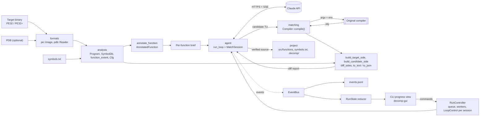

# Architecture

Decomp is one C++23 code base that premake5 builds into a static library (`decomp_lib`), a console
tool (`decomp`), a test runner (`decomp_tests`) and, from Phase 1, a desktop GUI (`decomp-gui`). Work
passes through seven stages: ingest, analyze, annotate, match, agent, project and supervise. Each stage
is implemented by a module under `src/`, and the modules are strictly layered: the format parsers and
the disassembler know nothing about the agent, and the agent knows nothing about the UI. Everything the
agent does is published as a typed event, which the CLI, the GUI and the on-disk logs consume. This
document covers goals, fixed decisions, the module design, data flow, threading, error handling, the
build and platform notes. Matching, the agent, the UI and the project format each have their own
document.

Status: the [first slice](roadmap.md#first-working-slice) and the [Phase 1](roadmap.md#phase-1-supervision-gui-and-batch-runner)
runner are implemented: `decomp run` works on many functions with several workers, and `decomp-gui`
opens projects, starts, steers and reopens runs. The type and function names below are the ones in the
code, and the headers are authoritative. Anything marked *planned* does not exist yet.

## Goals and non-goals

**Goals**

- Produce C++ source that compiles byte-for-byte identical with the target's original toolchain,
  one function at a time, with mechanical verification of every match.
- Own the AI loop: Decomp calls the Claude API directly, runs the tools, enforces budgets and records
  everything.
- Make everything the agent does visible and controllable, live and after the fact.
- Stay self-contained: no external applications at runtime except the target's toolchain.
- Run on Windows first, where old MSVC versions run natively. Linux is supported for development
  and CI.
- Keep project state deterministic and friendly to git.
- Keep the core ISA-agnostic so that formats and decoders can be added later.

**Non-goals**

- A decompiler engine. Decomp produces no pseudo-C; it invests in annotated disassembly and a fast
  compile/diff loop instead.
- MCP or external agent frameworks.
- Executing target or candidate code. There is no emulation and no dynamic analysis, and candidates
  are only compiled.
- Modifying the target binary.
- Replacing a general-purpose reverse-engineering suite. The binary explorer exists to serve
  matching.
- Shipping compilers. Users supply the original toolchains.

## Fixed decisions

| Topic | Decision |
|---|---|
| Targets | Windows x86 PE32 built by older MSVC (VC6 through VS2010) **and** modern x86-64 (PE32+ built by MSVC or clang-cl first; ELF64 built by GCC or Clang later). The core stays ISA-agnostic. |
| AI | **Built-in agent only.** The tool calls the Claude API itself and owns the loop, and the user supervises. No MCP. |
| Third-party code | Any library is allowed; external applications are not. |
| Decompiler | **Assembly only.** No decompiler engine; rich disassembly annotation and a fast compile/diff loop instead. |
| Host OS | **Windows primary** (old MSVC runs natively; premake generates Visual Studio solutions). Linux is supported for development and CI. |
| UI | Detailed visibility of everything the agent does, live and historical ([ui.md](ui.md)). |
| First milestone | Design docs, the Phase-0 scaffold and a first working slice that includes the agent loop, tested offline through replays. |

## Pipeline overview

| Stage | What happens | Module | Implemented | Later |
|---|---|---|---|---|
| Ingest | Parse the target image, its PDB and candidate objects | `formats` | PE32/PE32+, COFF `.obj` (including `/bigobj`), PDB 7.0, exports, imports, base relocations, CodeView, Rich header decode, x64 `.pdata` | COFF `.lib`, MSVC `.map` (Phase 2); ELF64 (Phase 7) |
| Analyze | Build the symbol database, find function bounds, build CFGs | `analysis` | Symbol import, bounds from symbol size, `.pdata` or recursive descent, jump tables, linker-thunk resolution, basic blocks and loop headers, a cross-reference scan for callers | Full cross-reference index, RTTI/vtables, library signatures (Phase 2) |
| Annotate | Turn a function into a readable, symbolized listing | `analysis` + `arch/x86` | Labels, symbolized operands, frame slot names, loop hints, switch tables | Field names from types (Phase 4) |
| Match | Compile a candidate, extract the function, diff it | `matching` | Toolchain registry, compile driver and cache, diagnostics, relocation-aware diff, verdicts, hints | Data matching and relinking (Phase 5), flag search and permuter (Phase 6) |
| Agent | Run one Claude conversation per function | `agent`, `run` | Transports, SSE, client, append-only conversation, tools, loop, live control and limits, transcripts, cost, shared rate gate, approvals; the multi-worker run controller with its queue and resumable run directories | More tools (Phases 3-4) |
| Project | Persist sources, symbols, history and progress | `project` | `init`, `symbols.txt`, status and history, verified sources, `status` | Translation-unit organization (Phase 3), headers and types (Phase 4) |
| Supervise | Show everything live and historically; take commands | `events`, `cli`, `gui` | Events, the serialized `EventBus`, `RunState` and copy-on-write snapshots, JSONL log, CLI progress view, Ctrl+C and `--interactive` commands, `decomp-gui` | Later-phase views ([ui.md](ui.md#views)) |

## Data flow



The same diff path serves the human-driven commands: `decomp diff --source` compiles and diffs
without the agent, and `decomp diff --obj` skips compilation. Compile and diff events
(`compile_finished`, `diff_computed`) are published by the agent's session around each compile.

## Module design

### Layering

Lower layers never include higher ones:

```
cli, gui                  entry points; argument parsing, rendering
  viewmodel               what the GUI's views show, derived without ImGui (progress, tables, charts, notifications)
  run                     selection, work queue, run directories, RunController (N workers)
  agent                   run_loop, tools, Claude client, rate gate, approvals, MatchSession, runner
    project               decomp.json, symbols.txt, history, verified sources, locks, change logs
    matching              toolchains, compile, diff
      analysis            Program, SymbolDb, bounds, CFG, annotation, demangling
        arch/x86          decoding, formatting
        formats           PE, COFF, PDB (BinaryImage interface)
  events                  event types, EventBus, RunState, progress view (depends on core only)
core                      errors, logging, fs, bytes, hashing, processes, JSON
```

Event payloads are plain data (strings, numbers, JSON values), so `events` depends only on `core`,
and producers (`agent`) and consumers (`cli`, `gui`) can both depend on it without cycles.

### core

Shared infrastructure, used by everything else:

| Header | Provides |
|---|---|
| `core/result.hpp` | `ErrorCode`, `Error{code, message}` with `with_context()` and `describe()`, `Result<T> = std::expected<T, Error>`, `make_error(code, fmt, args...)`, the `TRY` and `TRY_ASSIGN` macros |
| `core/log.hpp` | `decomp::log` levels (trace to error), colored stderr (TTY auto-detect), mirror to a file, extra sinks called outside the logger's lock (`remove_sink` waits for calls in flight; runs use one to publish `log` events), a per-thread `ScopedContext` that tags lines with a worker and session, and an in-memory ring of recent lines (`recent()`) |
| `core/fs.hpp` | UTF-8 path conversion, `read_file`/`read_text`, atomic `write_file`/`write_text` (temp file + rename, retried briefly on Windows while another process has the file open), `append_text`, `find_upwards`, `TempDir` |
| `core/bytes.hpp` | `ByteSpan`, bounds-checked little-endian `read_le<T>`, sequential `ByteReader`, `read_cstring_at` |
| `core/hash.hpp` | Streaming `Sha1`, `sha1_hex` |
| `core/process.hpp` | `ProcessSpec{argv, cwd, env overrides, timeout, stdin, cancelled}` and `run_process()` returning `ProcessResult{exit_code, out, err, timed_out, cancelled, duration}`. POSIX uses fork/exec and poll on close-on-exec pipes (so parallel workers never inherit each other's pipes), with the child in its own process group; Windows uses `CreateProcessW` with a job object and pipe threads. Waits are sliced, so a `cancelled` callback (Abort) ends the process tree within a fraction of a second. Also MSVCRT-correct argument quoting (`quote_windows_arg`, `build_windows_command_line`). |
| `core/file_lock.hpp` | `FileLock::acquire(path, shared or exclusive, timeout)` and `try_acquire`: advisory locks that conflict between processes and between lock objects of one process (`flock` on a descriptor of its own on POSIX, `LockFileEx` on Windows) |
| `core/json.hpp` | `Json` (nlohmann, keys kept sorted so dumps are deterministic), `parse_json`, compact and pretty dumps, accessors that turn missing fields into errors or defaults |
| `core/strings.hpp` | `trim`, `split`, `parse_u64` (accepts `0x...`, `...h`, decimal), `hex`, `truncate_utf8`, `escape_c_string`, UTF-8/UTF-16 conversion on Windows |

(Response files for long compiler command lines are written by the compile driver in `matching`. The
GUI's background jobs run on a thread pool of its own, `gui/jobs.hpp`.)

### formats

Readers for binary formats, all built on `ByteReader` and returning `Result`:

- `pe::Image`: PE32 and PE32+ headers and sections; RVA/VA/file-offset conversion; exports; imports
  mapped to IAT slots; base relocations; the CodeView record (`RSDS` with PDB path, GUID and age, or
  `NB10`); the Rich header (`formats/rich.hpp`, see [Compiler identification](#compiler-identification));
  x64 `.pdata` entries, with chained unwind entries resolved to the function they continue.
- `coff::Object`: regular and `/bigobj` objects; sections, including COMDAT selection and
  associativity from the section-definition auxiliary records; symbols and their auxiliary records;
  relocations; the string table.
- `pdb::Reader` over raw_pdb: procedures (`S_GPROC32`/`S_LPROC32`) with code size and module, data
  symbols, public symbols (`S_PUB32`) for decorated names, modules, section contributions (input for
  translation-unit recovery in Phase 3), and a GUID/age check against the image. raw_pdb reads the
  PDB 7.0 format used since Visual Studio .NET 2002 and by lld-link. VC6-era PDB 2.0 files (`NB10`)
  use an older container that it does not read, so such targets rely on exports, map files (Phase 2),
  user symbols and analysis.
- `map::MapFile`: link maps in the link.exe format (also written by lld-link): sections, public and
  static symbols with their object files and `f` (function) flags, the entry point and the timestamp.
- `BinaryImage`: the interface the rest of the code uses (architecture, image base and size, entry
  point, sections, bytes at a VA, relocation lookup), so that ELF can be added in Phase 7 without
  touching analysis or matching.

#### Compiler identification

`parse_rich_header()` decodes the Rich header and checks its key against the checksum of the DOS
header, the stub and the entries. `rich_product()` names each product ID of Microsoft's enumeration
(`Utc12_CPP`, `Linker600`, `Masm614`, ...) with its tool, its version (12.00 for the VC6 compiler,
6.00 for its linker), its language and variant (Standard edition, LTCG, PGO, CIL) and the Visual
Studio release it came with. Visual Studio 2015 and later share product IDs (compilers 19.xx,
linkers 14.xx): `tool_version()` tells them apart by build number (a table of each toolset's first
build, from Visual Studio 2015 to 2022 17.14) or, for the tools that share the image linker's build,
by the image's linker version, whose minor number is the toolset's (14.51 for compiler 19.51), so
newer toolsets are identified too. `identify_build()` sums a header up as `BuildInfo`: compilers and
assemblers by objects, the linker, imports, objects without a tool ID, and the compiler the image's own
code most likely came from (`main_compiler()`). `matching::suggest_toolchain()` turns that into a
toolchain suggestion ([matching.md](matching.md#choosing-the-toolchain)).

### arch/x86

Decoding and formatting, built on Zydis (`arch/x86/decoder.hpp`):

```cpp
// Abridged from arch/x86/decoder.hpp.
struct Field {                  // a byte span that holds a displacement or an immediate
    u8 offset; u8 size; FieldKind kind;   // disp | imm | rel
    i8 operand;                 // index into Instruction::operands
    i64 raw;                    // value as encoded
    u64 absolute;               // address, or the destination of a relative/RIP-relative field
    bool rip_relative;
};
struct Instruction {
    u64 address; u8 length; std::array<u8, 15> bytes;
    std::string mnemonic, prefix;          // "jz"; "lock ", "rep " ...
    std::vector<Operand> operands;         // reg | mem{segment, base, index, scale, disp} | imm | pointer
    std::vector<Field> fields;
    Flow flow;                             // none, jump, cond_jump, call, ret, indirect_jump, indirect_call, trap, halt
    std::optional<u64> branch_target;      // direct branch or call destination
    std::optional<u64> memory_target;      // absolute or RIP-relative memory operand
};
```

`fields` come from Zydis' raw instruction data (displacement and immediate offsets and sizes, and
whether an immediate is relative). These spans are the only places an address can live, and the diff
relies on them. The Intel-syntax formatter (`x86::render`) takes a field renderer hook, so the same
formatter prints raw listings, annotated listings and diff rows. `x86::Decoder` is a concrete class; an
ISA-neutral decoder interface for other ISAs is planned (Phase 7).

### analysis

- `Program`: a loaded target (image, decoder and symbols). `Program::open()` loads the image and its
  PDB (given, or found next to the image through the CodeView record or `<stem>.pdb`; a PDB whose GUID
  and age do not match is ignored), builds the `SymbolDb`, and moves names off incremental-linking
  thunks. `with_symbols()` makes a new *symbol generation* that shares the image and decoder; workers
  hold a `shared_ptr<const Program>`, so a symbol edit during a run builds a new generation that later
  sessions pick up while running sessions keep theirs. It resolves names and addresses (`resolve()`),
  finds function extents and instructions, scans cross-references on first use (`xrefs_to()`,
  `callers_of()`; `xrefs_from()` lists what one function references: calls, jumps out, reads, writes
  and addresses), and follows linker thunks
  (`thunk_destination()`).
- `scan_strings()` (`analysis/strings.hpp`): ASCII and UTF-16LE strings in the non-executable sections,
  cut at symbol boundaries; `string_refs()` finds the functions that use one.
- `SymbolDb`: `std::map<va, Symbol>` with `Symbol{name (decorated), display (demangled), pdb_name,
  kind: function | data | string | float | import | label | unknown, size, source: analysis | import |
  export | pdb_public | pdb | agent | user, is_static, aliases}` and both exact and containing-address
  lookups. It is populated from the PDB, exports, imports, x64 `.pdata` and `symbols.txt`. A more
  trusted source takes over the primary name at an address; the other names become aliases (see
  [matching.md](matching.md#opticf-folding)). Function status is kept by `project`, not here.
- Demangling through LLVM's Demangle library (MSVC and Itanium schemes), plus the undecorated and
  qualified forms used for name equivalence.
- `Program::function_extent()`: the symbol size when known; otherwise recursive descent from the
  entry, bounded by the section and the next known function, stopping at `ret`, `int3` and jumps that
  leave the function. Indirect jumps through tables (`jmp [r*4+table]` on x86; the clang and MSVC x64
  patterns) have their tables read as data, not decoded as code.
- `Cfg` (`build_cfg()`): basic blocks, edges, loop headers (targets of back edges) and loop depths.
- `annotate_function()` produces an `AnnotatedFunction`: `loc_<address>` labels, operands symbolized
  with demangled names, comments for strings, floats, imports, frame slots (`arg_N`/`var_N` derived
  from `esp`/`ebp`/`rsp`/`rbp` offsets), switch tables, loop headers and back edges, tail calls, plus
  callers, callees and data references. The annotated listing is what the agent and the human read;
  there is no decompiler output.

### matching

The compile and diff engine ([matching.md](matching.md) has the full design):

- `Toolchain{name, kind: msvc | clang_cl | gcc | clang, compiler, wrapper, flags, include_dirs, env,
  env_prepend, description, timeout_seconds}` and `ToolchainRegistry`, which reads the user-level
  registry and adds auto-detected clang-cl entries. Per-project overrides are planned.
- `Compiler::compile()` returns `CompileResult{ok, object_data, diagnostics[{file, line, column,
  severity, code, message}], output, command, duration, cached, timed_out}`. It has diagnostic parsers
  for MSVC-style and GCC-style output, and a compile cache keyed by a SHA-1 of the toolchain, flags,
  source and include directories.
- `build_target_side()` (instructions and their address references from the image),
  `build_candidate_side()` (the same for a candidate object, from its COFF relocations),
  `diff_sides()` (alignment, row classification, verdicts, hints, bindings) and the reports
  `to_text()`, `to_json()` and `summary_line()`. `compile_and_diff()` (`matching/match.hpp`) compiles a
  source and diffs one function.

### events

The backbone shared by the CLI, the GUI and the logs ([ui.md](ui.md#architecture) has the consumer
side):

- Typed events: a `std::variant` of plain structs, each stamped with a sequence number, a UTC time,
  the run ID and, where it applies, a worker ID; payloads carry the session ID. The slice's types are
  `run_started`, `run_finished`, `session_started`, `session_finished`, `turn_started`,
  `turn_finished`, `stream_delta`, `tool_call_started`, `tool_call_finished`, `compile_finished`,
  `diff_computed`, `retry`, `refusal`, `guidance`, `status_changed`, `file_written` and `log`; the
  runner adds `run_resumed`, `compile_started`, `worker_phase_changed`, `rate_limit_updated`,
  `budget_changed`, `symbol_changed`, `approval_requested`, `approval_decided`, `queue_updated` and
  `control` ([ui.md](ui.md#events) lists their fields). Changes are additive: a slice-era
  `events.jsonl` still replays.
- `EventBus`: publishing from any thread is *serialized*. `publish()` assigns the sequence number and
  runs every subscriber under one lock, so subscribers see events one at a time in sequence order
  whatever thread publishes; a publish from inside a subscriber is queued and delivered right after
  the current event. `set_next_seq()` continues the numbering of a resumed run's log.
- `RunState`: a pure reducer that folds events into the run, its workers and sessions, the queue,
  pending approvals, rate limits, budgets, recent compiles, errors by kind, a log tail, worker phase
  spans and per-minute throughput. Every collection is capped, so a long run uses bounded memory.
- `RunStateStore`: the reducer behind a lock, with immutable snapshots for readers on other threads
  (the GUI takes one per frame). Snapshots are copy-on-write: sessions are shared pointers that the
  reducer clones before changing one that a snapshot still holds, and rarely changing collections
  (the queue, files written) are shared between snapshots.
- `JsonlEventLog` writes `events.jsonl` (all events except `stream_delta`), and `read_event_log()` plus
  `RunState::replay()` read a log back into the same state, which is how the reducer is tested, how
  `decomp runs show` summarizes a run and how the GUI opens past runs.
- `ProgressRenderer`: the CLI's live progress view, one line per worker.

### agent

The built-in agent ([agent.md](agent.md) has the full design):

- `HttpTransport` with a libcurl transport (Linux, macOS), a WinHTTP transport (Windows, no extra
  dependency) and `ReplayTransport` (tests and `--replay`).
- `SseParser`: incremental server-sent events parsing.
- `Client`: request headers, retries with backoff, message assembly from the stream
  (`MessageAccumulator`), capture of rate-limit headers, and `list_models()` (the GUI's key check).
- `RateGate` (`agent/rate_gate.hpp`): one per run, shared by every session's client. It reads the
  `anthropic-ratelimit-*` headers of every response (errors included), holds requests back while the
  request or token allowance is spent (below 2% left) until its reset time, and puts every session
  into backoff after a 429 or 529 until `retry-after`.
- `ApprovalGate` (`agent/approvals.hpp`): per-action policies (`automatic`, `ask`, `deny`) for gated
  actions; today the one action is `write_source`, saving a verified match. `ask` publishes
  `approval_requested` and waits (Abort ends the wait) until the supervisor decides.
- `Conversation`: the append-only message history. It serializes the system prompt, tools and model
  once and reuses them byte-identically.
- `ToolRegistry` with a JSON Schema validator, and `MatchSession`, which holds the per-function
  state and implements the match tools, the brief and the status line.
- `run_loop()`, which returns a `LoopOutcome`, and `LoopControl`, its thread-safe commands: pause,
  resume, stop and abort with a reason (user, skip, run budget, shutdown), guidance with an id that can
  be retracted until it is sent, and live `LoopLimits` (turns, tokens, USD, wall clock) that take
  effect at the next check. A `SpendLedger` shared by a run's sessions enforces the run budget.
- `run_function()` (`agent/runner.hpp`): one session from start to finish, with events, the transcript
  and project updates; its outcome is `matched`, `gave_up`, `refused`, `budget_exhausted`,
  `run_budget_exhausted`, `max_turns`, `no_result`, `skipped`, `stopped`, `aborted` or `error`. A
  session that ends without submitting a byte-exact best it already has submits it automatically.
- The frozen system prompt (`system_prompt()`), the price table and cost accounting (`agent/cost.hpp`).

### project

- `Project`: loads and saves `decomp.json`, resolves paths, and finds the project from the current
  directory (`fs::find_upwards`) or `-C/--project`; `Project::init()` creates one.
- Symbol file I/O (`symbols.txt`, sorted, one symbol per line), applied on top of the derived symbols.
- Function status and history (`.decomp/functions/<fn>/`) and the per-function counters behind
  `decomp status` (`project/progress.hpp`), and the match setup a session needs
  (`project/setup.hpp`).
- The write path is safe for parallel workers and other processes: every change to `symbols.txt`
  (`modify_function`, `set_symbol`) takes an in-process mutex and the exclusive
  `.decomp/project.lock`, starts from the latest file on disk, and bumps `version()`. Symbol edits are
  recorded in `.decomp/symbols.log.jsonl`.
- Writing verified sources (`write_matched_source`): the replaced content is kept in
  `.decomp/blobs/<sha1>`, every write is recorded in `.decomp/changes.jsonl`, and `revert_change`
  undoes one. `try_lock_active_run()` allows one live run per project. `target_status()` checks the
  target's SHA-1 and PDB. All writes are confined to project-managed paths
  ([project-format.md](project-format.md)).

### run

Batch runs ([agent.md](agent.md#batch-runs) has the behavior):

- `select_functions()` (`run/selection.hpp`): the default selection skips matched, refused, skipped
  and library functions, imports, linker thunks and functions without a size or recoverable extent.
- `WorkQueue` (`run/queue.hpp`): pending functions in dispatch order, with pins, moves, removal and
  requeueing.
- `RunStore` (`run/store.hpp`): a run's directory (`run.json`, `summary.json`, `events.jsonl`,
  `sessions/`, `run.lock`), `list_runs()`, `find_run()` and `run_summary()`.
- `RunController` (`run/controller.hpp`): N worker threads take functions from the queue and run one
  session each through an injectable `SessionFn` (the agent's `run_function` by default; tests pass a
  fake). Commands (pause all or one worker, stop, abort, skip, requeue, queue edits, concurrency, run
  budget, limits, guidance, approvals, policies) are thread-safe and each is acknowledged by a
  `control` event. `resume()` continues a stopped, budget-limited or interrupted run from its
  directory.

### cli

Commands built with CLI11 (`src/cli/`): `init`, `info`, `funcs`, `disasm`, `diff`,
`toolchain list|test|add`, `status`, `agent`, `run` and `runs list|show`. Global options, which may come before or after the
command name, are `--json`, `-v`/`--verbose` (repeat for trace), `-q`/`--quiet` and `-C`/`--project <dir>`, plus
`--version`. `diff` takes `--source <file>` or `--obj <file>` (plus `--all` with `--obj`), and exits
with 0 when byte-exact, 2 when the function differs and 3 when the compile failed (with `--all`, 0
only when every function the object shares with the target is byte-exact, and 2 when any differs or
none is shared). `agent` adds the
live progress view, `--replay <file>`, `--interactive`, `--guidance`, budget overrides and model
options, and exits with 0 when matched, 2 when not matched, 3 when refused and 1 on error or abort.
`run` takes functions or a selection (`--all`, `--status`, `--filter`), `--workers`, budgets,
`--policy`, `--replay-dir`, `--resume <id>` and `--interactive`, and exits with 0 when the run
completed, 2 when it stopped or ran out of budget (resumable) and 1 when it was aborted or failed.
Errors are printed as `error: <message>` with exit code 1.

### viewmodel

Everything a GUI view displays beyond the raw snapshot is computed here (`src/viewmodel/`, namespace
`decomp::vm`, part of `decomp_lib`), as pure functions over a `RunStateData` snapshot, the project's
state and the run files, with no ImGui. Views only draw the results, and expensive derivations run as
background jobs; each header says what its functions cost.

| Header | Provides |
|---|---|
| `progress.hpp` | Dashboard progress: `decomp status`'s numbers, status segments with the live overlay, the best-match distribution, progress over time from run summaries |
| `treemap.hpp` | Squarified treemap layout, the treemap of the code by section, hit testing |
| `difficulty.hpp`, `eta.hpp` | Code features and a difficulty score per function; session durations by size bucket and the queue's ETA |
| `function_table.hpp` | Function browser rows, filter and multi-column sort (an index permutation) |
| `series.hpp` | Chart series: throughput per minute, spend, cache-hit rate, scores per attempt, the worker timeline |
| `cost.hpp` | Spend by run, day, model and function; per-match figures; the projection for the remaining functions |
| `transcript.hpp` | The incremental transcript reader and its Markdown export |
| `line_diff.hpp` | Myers line diffs, unified hunks and side-by-side rows |
| `notification_rules.hpp` | The [notifications](ui.md#notifications), each posted once |
| `exports.hpp` | Progress, cost, function list and diff exports (Markdown, JSON, CSV) |

### gui

`decomp-gui` is a separate application built with Dear ImGui (docking), ImPlot, GLFW/OpenGL 3 and
ImGuiColorTextEdit ([ui.md](ui.md) is the specification). It links `decomp_lib` like the CLI and
contains no matching or agent logic of its own:

- `Workspace` (`gui/workspace.hpp`): what the GUI has open, without ImGui. A project and its program
  load on a background thread; the run the views show is either live (a `RunController` with its event
  log, `RunStateStore` and log sink) or past (its `events.jsonl` replayed through the same reducer,
  read-only). Workers wake the UI loop at most once per frame.
- `AppServices` and `RunCommands` (`gui/services.hpp`): the views' only way to the workspace and the
  controller, so the shell renders headless in tests with fakes.
- `App` (`gui/app.hpp`): the docking shell, chrome (top bar, status bar, notifications, command
  palette), actions and shortcuts, navigation history, settings and the view list
  (`gui/views/views.cpp`). Each frame takes one snapshot, and every view renders from it.
- `JobQueue` (`gui/jobs.hpp`): a small thread pool for the views' expensive work; the UI polls
  results once per frame, and every job has a cancellation token.
- `decomp_gui_lib` holds all of this without a window system; `src/gui/platform/` adds GLFW, the
  OpenGL 3 backend and `main()`.

## Key flow: `decomp agent <func>`

1. `project` loads `decomp.json`, and `Program::open()` loads the image and PDB (with a warning when
   the target's SHA-1 differs); `symbols.txt` is applied and the function is resolved.
2. The toolchain is resolved by name from the registry, and the agent settings are merged with the
   command-line overrides. A missing `ANTHROPIC_API_KEY` stops here, unless `--replay` is given.
3. The CLI creates the run directory under `.decomp/runs/` (`RunStore::create()`, which takes its
   `run.lock`), an `EventBus` with the JSONL log and the progress view, and starts a one-function run
   on a `RunController` with one worker, which publishes `run_started`. Ctrl+C (and `--interactive`
   input) are turned into controller commands.
4. `run_function()` announces the function as `in_progress` (an event; it is not written to
   `symbols.txt`), builds the tools, the
   conversation (system prompt and tool definitions) and the brief (annotated listing, referenced
   symbols, callers, history), and runs the loop.
5. `run_loop()` sends each request and streams the response; text and thinking deltas become
   `stream_delta` events.
6. For each tool call, `MatchSession` runs the tool. `compile_and_diff` writes the candidate to a fresh
   build directory, runs the original compiler through `run_process` (or takes the result from the
   cache), extracts the function from the object and diffs it. The attempt is appended to the
   function's history.
7. All tool results go back in one message, followed by any supervisor guidance and the status line.
   The loop repeats until `submit_result`, a budget, a refusal, a stop or an error ends it.
8. On a verified match, `MatchSession` writes the source to `src/functions/`. When the session ends,
   `symbols.txt` gets the function's new status, best score, attempts and spend.
9. The controller publishes `run_finished` and writes `run.json` and `summary.json` (so
   `decomp runs list` and the GUI list the run, and a stopped one can be resumed). Throughout, the
   event log and the transcript are appended, and the progress view renders the `RunState`.

## Key flow: a batch run

1. `decomp run` (or the GUI's Start) loads the project and its program, takes the project's
   active-run lock, and picks the functions: the ones named, or a selection (`select_functions()`).
2. `RunStore::create()` makes `.decomp/runs/<id>/` and takes its `run.lock`. An `EventBus` gets the
   JSONL log, a `RunStateStore` and, in the CLI, the progress view; a log sink turns warnings and
   errors into `log` events.
3. `RunController::start()` publishes `run_started` and starts N workers. Until the first session
   hears back from the API (or 30 s pass), only one worker runs, so the others find the shared prompt
   prefix in the cache.
4. Each worker takes the next queued function and runs one session (`run_function()` with a fresh
   `LoopControl`, the run's rate gate, spend ledger and approval gate, and the current program
   generation). Sessions write their transcripts to `sessions/` and publish their events with the
   worker's id.
5. Commands from the CLI's `--interactive` input or the GUI go to the controller, which changes its
   state, forwards the command to the affected sessions' `LoopControl`, and publishes `control`.
6. `run.json` is rewritten at every transition and `summary.json` as functions finish. When the queue
   is empty (or the run is stopped, aborted or out of budget), the last worker publishes
   `run_finished`, and the locks are released.
7. `decomp run --resume <id>` (or Resume in the GUI) reopens the directory: finished functions stay
   finished, and interrupted, stopped and failed ones start again with a fresh conversation whose
   brief carries their attempts, notes and best source. The event numbering continues the log.

## Threading model

| Thread | Runs | Notes |
|---|---|---|
| Main (CLI) | The command. `decomp agent` and `decomp run` start the controller and wait for it. | |
| UI (`decomp-gui`) | The GLFW event loop: one ImGui frame per wake-up, rendering one `RunStateStore` snapshot | GLFW requires the main thread. The loop sleeps until input or a worker's wake-up (at most once per frame). |
| Workers | `decomp run` and the GUI: N `std::jthread`s owned by the `RunController`, each running one session at a time (request building, HTTP streaming, tools, compiles); `decomp agent`: one | Concurrency can change during a run; workers above the new limit retire after their session. |
| Tool tasks | Consecutive read-only tool calls of one turn (`disassemble`, `read_memory`, `lookup_symbol`), started with `std::async` | Results are still reported in call order. |
| GUI background work | Loading a project and its program, replaying a past run (one thread each), and `JobQueue`'s pool for the views' expensive derivations | Results are taken on the UI thread; cancelled jobs' results are dropped. |
| Interrupt watcher | Turns Ctrl+C into a stop (first), then an abort (second) | Polls a counter set by the signal handler, which itself exits the process on a third Ctrl+C. |
| Stdin reader | `--interactive` only: commands and guidance | Detached; blocks on stdin. |

Event subscribers (the JSONL writer, the reducer, the progress view) run on whichever thread
publishes the event, one event at a time under the bus's lock.

Rules:

- **Events are totally ordered.** `publish()` assigns unique, increasing sequence numbers and
  delivers in that order, and `read_event_log()` sorts by them, so the JSONL file is a faithful
  replay source and a live run's state equals its replay.
- **No lock cycles with the bus.** Components never publish while holding their own locks (the
  controller changes its state, unlocks, then publishes `control`), and subscribers never call
  commands.
- **The UI never blocks workers.** The reducer's work per event is small, and `snapshot()` costs
  little: sessions are shared between snapshots and copied only when an event changes one that a
  snapshot still holds. A view that needs more than the snapshot (a transcript, a diff) reads files
  or runs a job, never the controller's state.
- **Commands are honored at safe points.** `LoopControl` holds the commands. The loop checks pause,
  stop and abort before each request, and appends queued guidance to the next user message. Abort also
  cancels the request in flight (the transports poll a cancellation callback: libcurl about once a
  second while idle, WinHTTP when the next chunk arrives), retry and rate-limit waits, and running
  compiles (the process tree is killed).
- **Compiles are limited globally.** A counting semaphore (`set_max_parallel_compiles()`, one per
  hardware thread by default) bounds concurrent compiler processes across workers, compile
  directories are unique per process and thread, and each MSVC compile gets its own `mspdbsrv`
  endpoint ([matching.md](matching.md#isolating-parallel-compiles)).
- **Rate limits are shared.** All sessions of a run go through one `RateGate`.
- **Project writes are serialized.** An in-process mutex plus `.decomp/project.lock` order every
  write to `symbols.txt` and the logs beside it, across workers and across processes.

## Error handling conventions

- Fallible functions return `Result<T>` (`std::expected<T, Error>`). `Error` carries an `ErrorCode`
  (`io`, `parse`, `not_found`, `invalid_argument`, `unsupported`, `process`, `timeout`, `network`,
  `api`, `cancelled`, `internal`) and a message. `with_context()` prefixes context while the error
  propagates, so users see chains such as `<path>/decomp.json: unsupported decomp.json version 2`.
- Errors propagate with `TRY` and `TRY_ASSIGN`:

  ```cpp
  Result<AnnotatedFunction> annotate_at(const project::Project& p, std::string_view name) {
      TRY_ASSIGN(auto program, p.open_program());
      auto va = program.resolve(name);
      if (!va) return make_error(ErrorCode::not_found, "unknown function '{}'", name);
      return annotate_function(program, *va);
  }
  ```

- No exceptions cross module boundaries. Code that calls a throwing library (nlohmann::json,
  throwing `std::filesystem` overloads) catches at the call site and converts the exception, as
  `parse_json` does. Prefer the `std::error_code` overloads.
- A process that cannot start is an error. A non-zero exit code or a timeout is data in
  `ProcessResult`, because a failing compile is a normal outcome.
- In the agent, a tool failure becomes a `tool_result` with `is_error: true` so the model can recover.
  Infrastructure failures (non-retryable API errors, an exhausted retry budget, an exhausted replay
  script) end the session with outcome `error`. User stops and aborts end it with `stopped` and
  `aborted`.
- Errors are logged once, where they are handled, not where they are created. Log lines go to stderr
  (and optionally a file). During `decomp agent`, warnings and errors are also published as `log`
  events, so they reach the run's `events.jsonl` and the views. Log sinks run outside the logger's
  lock, so a sink may itself cause logging.
- The CLI prints `error: <message>` and exits with 1. `decomp diff` uses 2 for "differs" and 3 for a
  failed compile, and `decomp agent` uses 2 for "not matched" and 3 for "refused"; argument errors
  are reported by CLI11 with its own exit codes.

## Build system and dependencies

premake5 (v5.0.0-beta8; feature use verified against its source) generates Visual Studio 2022 (or
2026) solutions and GNU makefiles from `premake5.lua` and `premake/deps.lua`.

| Project | Kind | Contents |
|---|---|---|
| `zycore`, `zydis` | StaticLib (C) | Zydis and its Zycore dependency, `ZYDIS_STATIC_BUILD`/`ZYCORE_STATIC_BUILD`. Zycore's OS-specific `src/API` files are not built. |
| `raw_pdb` | StaticLib | PDB reading |
| `llvm_demangle` | StaticLib | LLVM's Demangle library (MSVC, Itanium, Rust, D) |
| `imgui`, `implot`, `imgui_text_edit`, `glfw` | StaticLib | The GUI libraries (below) |
| `decomp_lib` | StaticLib | All of `src/` except `cli/` and `gui/` |
| `decomp` | ConsoleApp | `src/cli/` |
| `decomp_tests` | ConsoleApp | `tests/` except `fixtures/` and `gui/`, with `DECOMP_SOURCE_DIR` defined so tests find fixtures |
| `decomp_gui_lib` | StaticLib | `src/gui/` except `platform/`: the shell and the views, without a window system |
| `decomp-gui` | WindowedApp | `src/gui/platform/`: GLFW, the OpenGL 3 backend, `main()` |
| `decomp_gui_tests` | ConsoleApp | `tests/gui/`: the shell and every view rendered headless |

Workspace settings: platform `x64`; `Debug` (defines `DECOMP_DEBUG`) and `Release` (`NDEBUG`,
optimize for speed) configurations; symbols always on; multi-processor compile. C++23 (`cppdialect
"C++23"`, or `C++latest` under Visual Studio actions so that older VS 2022 updates work). On MSVC:
`/utf-8 /permissive- /Zc:__cplusplus /Zc:preprocessor`, a static runtime (standalone executables),
and `UNICODE`, `_UNICODE`, `NOMINMAX`, `WIN32_LEAN_AND_MEAN`, `_CRT_SECURE_NO_WARNINGS`. Decomp's own
code builds with extra warnings; third-party projects build with warnings off. Outputs go to
`bin/<cfg>/`, third-party libraries to `build/lib/<cfg>/`, intermediates to `build/obj/<cfg>/<project>/`.

Link order is `decomp_lib`, then the third-party libraries, then system libraries: `winhttp` on
Windows, `curl` and `pthread` on Linux, `curl` on macOS. That order keeps GNU ld's `--as-needed` from
dropping libcurl.

**Dependency strategy.** Libraries are fine; external applications are not.

- Git submodules for actively developed C libraries: Zydis v4.1.1 (which brings Zycore) and raw_pdb
  at `43cc59b` (it has no upstream tags).
- Vendored, unmodified copies for headers and small libraries: LLVM Demangle (`llvmorg-23.1.2`, the
  only addition being a two-line stand-in for LLVM's generated `llvm-config.h`), nlohmann/json
  v3.12.0, doctest v2.5.3, CLI11 v2.7.2, stb_image_write and the GUI fonts.
- The only system library is libcurl on Linux and macOS. WinHTTP ships with Windows.
- No package manager. Everything is built from source by premake, so a fresh clone builds the same
  way everywhere.
- Each library keeps its license file next to it, and [external/README.md](../external/README.md)
  lists versions and licenses. To add a library: vendor it or add a submodule, add a premake project
  in `premake/deps.lua` with warnings off, extend `use_thirdparty()`/`link_thirdparty()`, and update
  `external/README.md`.

**GUI libraries.** The GUI adds four submodules, built by `premake/deps.lua` as static libraries with
warnings off: `imgui` (Dear ImGui v1.92.9b-docking with `imgui_stdlib` and the null backend),
`implot` (v1.0), `imgui_text_edit` (ImGuiColorTextEdit v1.92.9, which includes `imgui_internal.h` and
so needs that exact ImGui) and `glfw` (3.5.1: Win32 on Windows, X11 only on Linux). Every translation
unit that includes `imgui.h` is compiled with `IMGUI_USER_CONFIG="imgui_config.h"`
(`src/gui/imgui_config.h`), which keeps `IM_ASSERT` on in Release builds; `use_imgui()` and
`link_imgui()` give a project the include paths, the define and the libraries. `decomp_gui_lib`
(`src/gui/` without `platform/`) needs no window system; `decomp-gui` adds GLFW and ImGui's GLFW and
OpenGL 3 backends, whose bundled GL loader means no GL headers or GL link; `decomp_gui_tests` renders
the shell headless with the null backend. On Windows the GUI links only libraries that ship with the
OS (`user32`, `gdi32`, `shell32`, `imm32`); on Linux the build needs the X11 development headers, and
GLFW and the GL loader open libX11 and libGL at run time.
The fonts (Roboto Medium and JetBrains Mono) are compiled in, and stb_image_write writes screenshots.

## Platform notes

- **Windows** is the primary platform. Old MSVC toolchains run natively, the process runner uses
  `CreateProcessW` with a job object (the compiler's whole process tree is killed on timeout) and
  MSVCRT-compatible argument quoting, and the HTTP transport is WinHTTP. Paths are converted between
  UTF-8 and UTF-16 at the API boundary.
- **Linux** is supported for development and CI. The process runner uses fork/exec with poll and kills
  the child's process group on timeout, and the HTTP transport is libcurl. clang-cl and lld-link run
  natively, which is how the test fixtures are built. MSVC on Linux through Wine, using the toolchain
  `wrapper` field, is planned ([matching.md](matching.md#environment-and-wrappers)).
- **macOS** may build (premake links libcurl there) but is not tested.
- **C++23 baseline:** MSVC 19.40+ (VS 2022 17.10+), GCC 14+, Clang 19+. Decomp uses `std::expected`,
  `std::print`/`std::format`, `std::span`, ranges and `std::byteswap`. It avoids
  modules, `std::flat_map`, `std::generator`, `std::stacktrace` and `std::mdspan`, whose support is
  uneven across these compilers.
- **Text:** internal strings are UTF-8, and sources compile with `/utf-8` on MSVC. Files Decomp
  writes are UTF-8 without a BOM and use LF line endings. Candidate sources compiled by old MSVC
  versions are read in the system code page, so non-ASCII bytes in string literals should be
  written as escapes ([matching.md](matching.md#determinism)).
